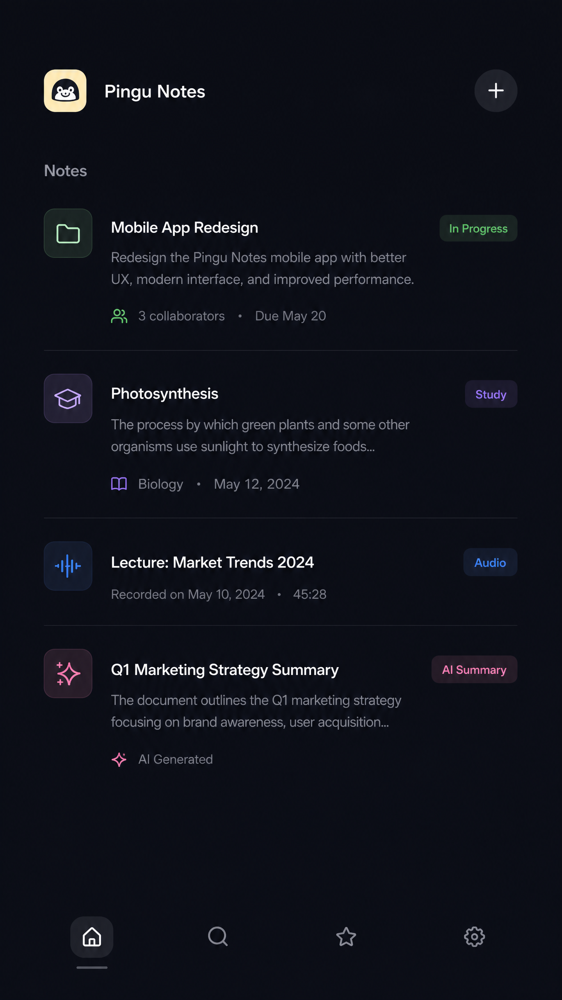
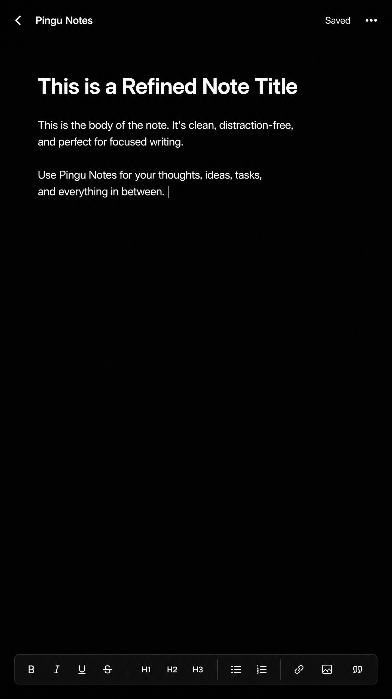
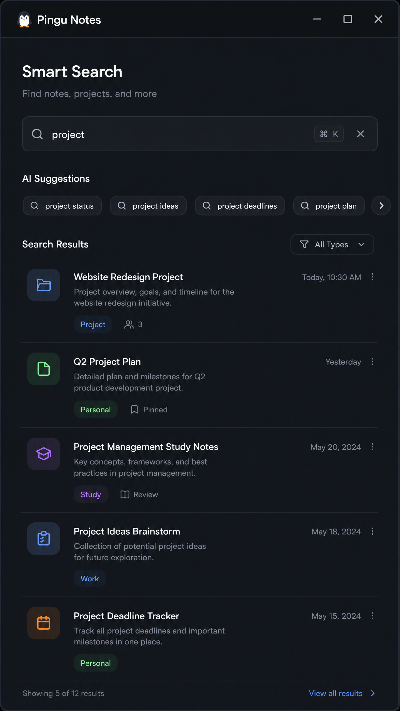
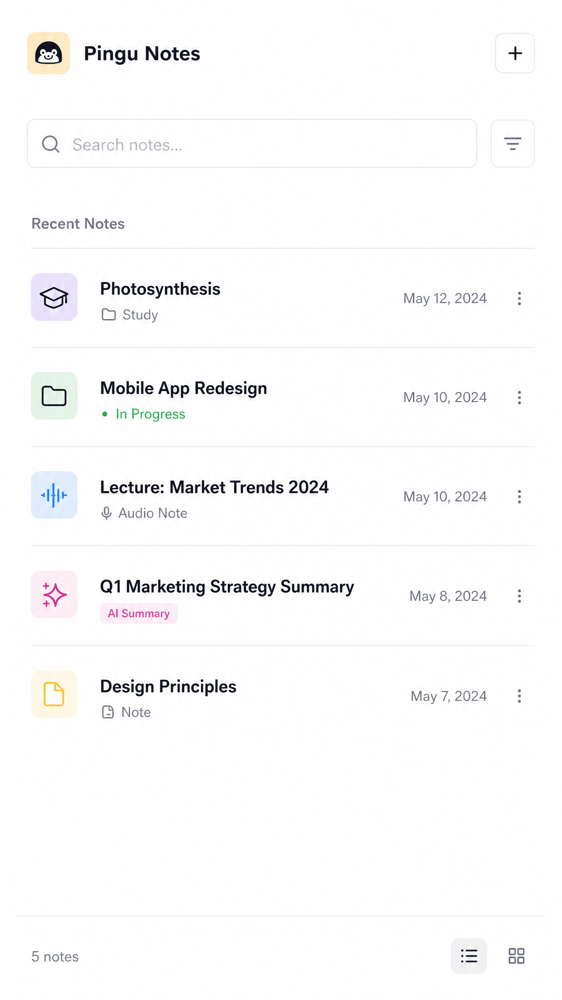
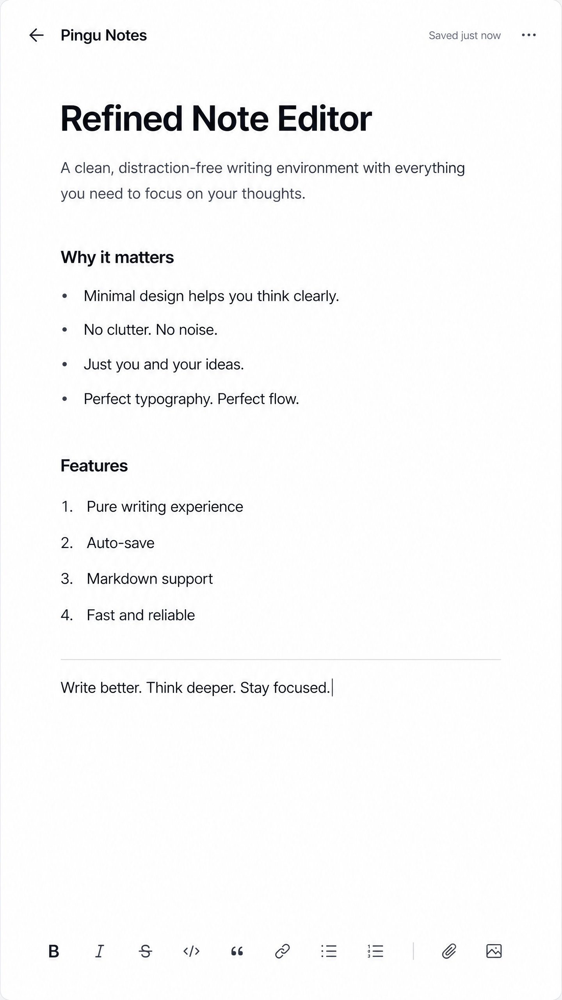
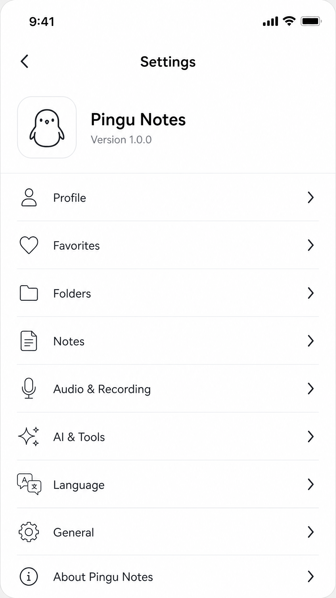

<div align="center">


# Pingu Notes

**Offline-first knowledge management for Android — built with Flutter, Clean Architecture and spaced repetition.**

[](https://github.com/joao-hg/pingu_notes/actions/workflows/ci.yml)
[](https://flutter.dev)
[](https://dart.dev)
[](https://www.sqlite.org)
[](LICENSE)

</div>

---

## What is Pingu Notes?

Pingu Notes is **not** a traditional note-taking app.

Its goal is to transform text, ideas, and captured knowledge into **organized, studyable, reusable material** — with a fully offline experience. There are no cloud dependencies, no accounts, and no internet requirement.

Core flow:

```
Capture → Organize → Relate → Review → Learn → Expand
```

The app was built to study and demonstrate **scalable mobile architecture**, **local data persistence**, and **knowledge management UX** in Flutter.

---

## Screenshots

<div align="center">

**Dark Mode**

<table>
  <tr>
    <td align="center">
      <br/>
      <sub><b>Splash</b></sub>
    </td>
    <td align="center">
      <br/>
      <sub><b>Home</b></sub>
    </td>
    <td align="center">
      <br/>
      <sub><b>Editor</b></sub>
    </td>
    <td align="center">
      <br/>
      <sub><b>Search</b></sub>
    </td>
  </tr>
</table>

**Light Mode**

<table>
  <tr>
    <td align="center">
      <br/>
      <sub><b>Splash</b></sub>
    </td>
    <td align="center">
      <br/>
      <sub><b>Home</b></sub>
    </td>
    <td align="center">
      <br/>
      <sub><b>Editor</b></sub>
    </td>
    <td align="center">
      <br/>
      <sub><b>Settings</b></sub>
    </td>
  </tr>
</table>

</div>

---

## Features

### Core
| Feature | Status |
|---|---|
| Note CRUD with auto-save | ✅ Complete |
| Projects with color picker | ✅ Complete |
| Full-text search (title, content, tags) | ✅ Complete |
| Swipe-to-favorite | ✅ Complete |
| Inbox / Organized categories | ✅ Complete |
| Timeline view (grouped by month) | ✅ Complete |
| Today view (tasks + reminders + reviews) | ✅ Complete |
| Dark / Light / System theme | ✅ Complete |
| Markdown editor with format toolbar | ✅ Complete |

### Knowledge OS
| Feature | Status |
|---|---|
| Spaced repetition (1/3/7/15/30-day intervals) | ✅ Complete |
| Mastery levels (never / learning / mastered) | ✅ Complete |
| Study goals with step-by-step progress | ✅ Complete |
| Achievements system (7 built-in, auto-unlock) | ✅ Complete |
| Ask Pingu — offline keyword AI | ✅ Partial |
| Style converter (Summary, Flashcard, Academic) | ✅ Partial |
| Knowledge gap detection (8-domain heuristics) | ✅ Partial |
| Review question generation per note | ✅ Partial |
| Scheduled review notifications | ✅ Complete |
| Knowledge connections graph | 🔜 UI pending |
| Pingu Voice (audio → transcription) | 🔜 Seam ready |
| Real AI backend (Whisper / Gemma / RAG) | 🔜 Planned |

---

## Architecture

Pingu Notes follows **Clean Architecture** with strict inward-only dependencies:

```
Presentation  →  Domain  ←  Data
                   ↑
                Services
```

```
lib/
├── core/
│   ├── theme/           # AppTheme, AppColors (design tokens)
│   └── utils/           # Shared helpers
│
├── domain/              # Pure Dart — no Flutter imports
│   ├── entities/        # Note, Project, StudyGoal, Achievement, ...
│   ├── repositories/    # Abstract interfaces (NoteRepository, KnowledgeRepository)
│   ├── usecases/        # One callable class per use case
│   └── services/        # IntelligenceService (abstract AI seam)
│
├── data/
│   ├── datasource/      # NoteLocalDataSourceImpl (SQLite v8, WAL mode)
│   ├── models/          # NoteModel, ProjectModel (extend entities + serialization)
│   └── repositories/    # NoteRepositoryImpl, KnowledgeRepositoryImpl
│
├── services/
│   ├── service_locator.dart           # GetIt DI wiring
│   ├── local_intelligence_service.dart # Offline AI (heuristics, keyword search)
│   └── notification_service.dart      # flutter_local_notifications singleton
│
└── presentation/
    ├── providers/        # NoteProvider (single ChangeNotifier)
    ├── pages/            # Full screens (HomePage, NoteEditPage, AskPinguPage, ...)
    └── widgets/          # Reusable components (NoteCard, ReviewPanel, PinguBrand, ...)
```

**Key decisions:**
- **Single ChangeNotifier** (`NoteProvider`) — simplified data flow for offline-first
- **IntelligenceService interface** — swap `LocalIntelligenceService` for Whisper/Gemma/RAG with zero changes to the rest of the app
- **SQLite WAL mode + foreign keys** — concurrent read safety and referential integrity
- **`Color.toARGB32()`** — compliant with Flutter 3.44+ / Dart ^3.12.1 (`.value` deprecated)
- **`FutureBuilder` futures stored in `initState()`** — prevents rebuild loops

Full architecture documentation: [ARCHITECTURE.md](ARCHITECTURE.md) · [docs/architecture.md](docs/architecture.md)

---

## Tech Stack

| Layer | Technology |
|---|---|
| UI Framework | [Flutter](https://flutter.dev) 3.24+ |
| Language | [Dart](https://dart.dev) ^3.12.1 |
| Local Database | [sqflite](https://pub.dev/packages/sqflite) 2.4 — SQLite v8 schema |
| State Management | [Provider](https://pub.dev/packages/provider) 6.1 |
| Dependency Injection | [GetIt](https://pub.dev/packages/get_it) 8.0 |
| Domain Entities | [Equatable](https://pub.dev/packages/equatable) 2.0 |
| Notifications | [flutter_local_notifications](https://pub.dev/packages/flutter_local_notifications) 17.2 |
| Typography | [Google Fonts](https://pub.dev/packages/google_fonts) — Poppins + Playfair Display |
| Internationalization | [intl](https://pub.dev/packages/intl) — pt-BR locale |
| Desktop DB support | [sqflite_common_ffi](https://pub.dev/packages/sqflite_common_ffi) |

---

## Getting Started

### Prerequisites

- [Flutter SDK](https://docs.flutter.dev/get-started/install) ≥ 3.24.0
- Dart ≥ 3.12.1
- Android device or emulator (primary target)

### Installation

```bash
# 1. Clone the repository
git clone https://github.com/joao-hg/pingu_notes.git
cd pingu_notes

# 2. Install dependencies
flutter pub get

# 3. Run on a connected device or emulator
flutter run
```

### Build for Release

```bash
# Android APK
flutter build apk --release

# Android App Bundle (recommended for Play Store)
flutter build appbundle --release
```

### Run Tests

```bash
# All tests
flutter test

# Specific test file
flutter test test/release_stress_test.dart

# Static analysis (must be 0 issues)
flutter analyze
```

---

## Roadmap

See [ROADMAP.md](ROADMAP.md) for the detailed feature status and sprint planning.

### Upcoming (Sprint 2)

- [ ] Language Converter UI — target languages: EN, ES, FR, DE, IT
- [ ] Ask Pingu UX improvements — query suggestions for empty state
- [ ] Knowledge connections UI in note editor
- [ ] DB: monitor index performance with larger datasets

### Upcoming (Sprint 3 — Pingu Voice)

- [ ] Audio recording with `record` package
- [ ] Audio file storage in app documents directory
- [ ] Audio player in note editor
- [ ] `transcribeAudio()` seam ready for Whisper integration

### Future

- [ ] Whisper.cpp via FFI — real audio transcription
- [ ] RAG local — note embeddings + vector similarity in SQLite
- [ ] Gemma / Llama via FFI — on-device chat tutor
- [ ] LibreTranslate / Argos offline translation

---

## Project Structure

```
pingu_notes/
├── lib/                    # Application source code
├── test/                   # Test suite
├── assets/                 # Icons and static assets
├── screenshots/            # App screenshots for documentation
├── docs/                   # Extended documentation
├── android/                # Android platform code
├── ios/                    # iOS platform code (config only)
├── ARCHITECTURE.md         # Architecture reference
├── CHANGELOG.md            # Version history
├── CONTRIBUTING.md         # Contribution guidelines
├── ROADMAP.md              # Feature roadmap
└── LICENSE                 # MIT License
```

---

## Contributing

Contributions are welcome! Please read [CONTRIBUTING.md](CONTRIBUTING.md) before submitting a pull request.

**Before opening a PR:**
1. Run `flutter analyze` — must return **0 issues**
2. Run `flutter test` — all tests must pass
3. Update `CHANGELOG.md` under `[Unreleased]`

---

## Author

**João Henrique Gonzaga**

- GitHub: [@joao-hg](https://github.com/joao-hg)
- LinkedIn: [linkedin.com/in/joao-hg](https://linkedin.com/in/joao-hg)
- Email: jvhenriquegonzaga@gmail.com

---

## License

This project is licensed under the MIT License — see the [LICENSE](LICENSE) file for details.

---

<div align="center">

Built with Flutter · Offline-first · Clean Architecture

</div>
